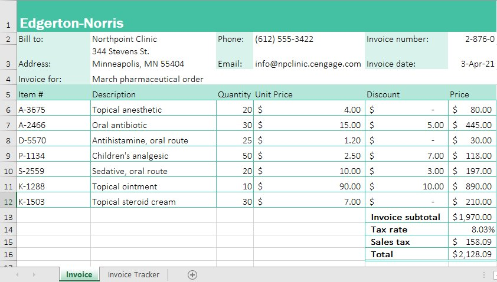
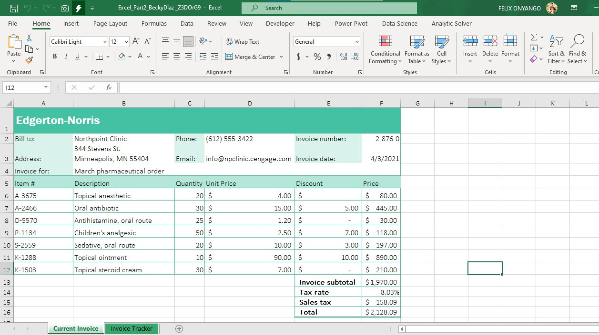
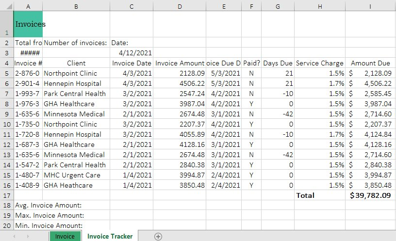
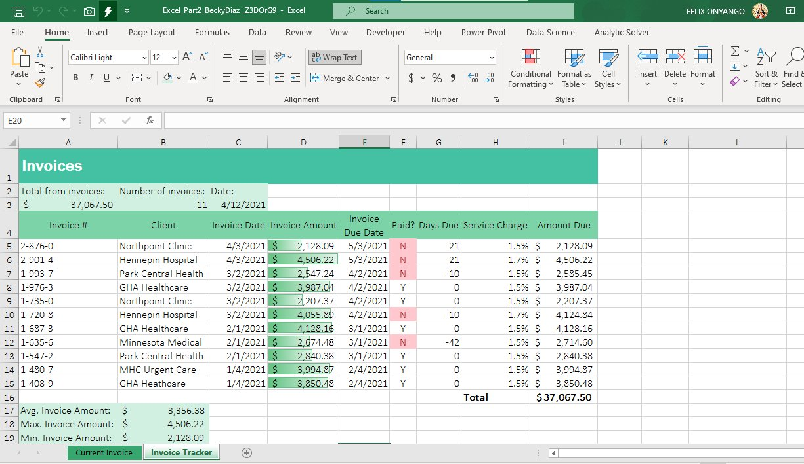

# 📊 Excel Data Analytics — Invoice Management Project
### Edgerton-Norris Pharmaceutical Invoice Workbook | Microsoft Excel 365

---

> **This project was completed as a freelance task for a client — a reminder that data skills are in demand everywhere, not just in corporate boardrooms. 💼**

---

## 📌 Project Overview

This project involved transforming a raw, unformatted pharmaceutical invoice workbook into a clean, professional, and audit-ready Excel solution. The workbook contains two worksheets:

- **Current Invoice** — Itemized invoice for Northpoint Clinic
- **Invoice Tracker** — Multi-client invoice tracking dashboard

| Detail | Info |
|---|---|
| 🛠 Tool | Microsoft Excel 365 |
| 📁 File | `Excel_Part2_BeckyDiaz.xlsx` |
| 👤 Client | Freelance Assignment |
| 🗓 Completed | April 2021 data · 2025 project |
| 🎯 Focus | Formatting, Functions, Conditional Formatting |

---

## 🔄 Before & After — Current Invoice Sheet

### ❌ Before


### ✅ After


---

## 🔄 Before & After — Invoice Tracker Sheet

### ❌ Before


### ✅ After


---

## ✅ What Was Done

### 🗂 Current Invoice Sheet
- Renamed worksheet tab from `Invoice` → `Current Invoice`
- Applied **Middle Align** to the worksheet title in cell A1
- Added **Outside Borders** with Green, Accent 4 color to the billing section (A2:F4)
- Applied **Short Date** number format to the invoice date cell

### 📋 Invoice Tracker Sheet
- Formatted the title with **Franklin Gothic Medium**, 18pt, White, Bold
- **Merged** the title across A1:I1
- Used **AutoFit** to resize Columns A and B for full text visibility
- Used **Conditional Formatting → Duplicate Values** (Light Red Fill) to identify duplicate invoices
- **Deleted** the first duplicate row
- Applied **COUNTA** formula in B3 to count active invoices
- Set Column E width to 9.00 and applied **Wrap Text** to the column heading
- Applied **Green, Accent 3, Lighter 80%** fill to summary ranges (A2:C3 and A17:B19)
- Decreased decimal places in A3 to 2 for dollar formatting
- Applied **40% – Accent 3 Cell Style** to the header row (A4:I4)
- Applied **Accounting Number Format** to invoice amounts (D5:D15)
- Added **Gradient Fill Green Data Bars** to visualize invoice amounts
- Applied **Conditional Formatting** to flag unpaid invoices (`N`) in Light Red Fill

### 📐 Formulas Used
```excel
=COUNTA(A5:A15)       → Count of invoices in B3
=AVERAGE(D5:D15)      → Average invoice amount in B17
=MAX(D5:D15)          → Maximum invoice amount in B18
=MIN(D5:D15)          → Minimum invoice amount in B19
```

---

## 📈 Key Results

| Metric | Value |
|---|---|
| 📄 Total Invoices | 11 |
| 💰 Total Amount Due | $37,067.50 |
| 📊 Average Invoice | $3,356.38 |
| ⬆ Max Invoice | $4,506.22 |
| ⬇ Min Invoice | $2,128.09 |

---

## 💡 Skills Demonstrated

`Microsoft Excel 365` `Conditional Formatting` `Data Bars` `COUNTA` `AVERAGE` `MAX` `MIN`
`Cell Styles` `Accounting Format` `Duplicate Detection` `Wrap Text` `AutoFit` `Merge & Center`
`Number Formatting` `Professional Data Presentation` `Freelance Delivery`

---

## 🚀 About Me

I'm **Felix Onyango**, a Data Analytics enthusiast based in Mombasa, Kenya 🇰🇪, passionate about turning raw data into clear, actionable insights.

📬 Connect with me on [LinkedIn](https://www.linkedin.com) | ⭐ Star this repo if you found it helpful!

---

*"You don't need a big company job to start applying your data skills. Freelance clients are looking for people who can solve real problems with data — RIGHT NOW."*
